# PRI — Production Resilience Intelligence

**A stateful digital twin for film production that computes what a disruption
actually costs, proves its own recovery plans are legal, and refuses to execute
one a human has not approved.**

A location falls through at 18:40 the night before the shoot. PRI reads the
event off Kafka, works out that three scenes and a downstream VFX plate are
blocked, generates recovery options, and — this is the part that matters —
**rejects one of its own plans** because it leaves the crew nine hours of
turnaround against a ten-hour minimum, then repairs it. A producer approves the
survivor, seven guards run in order, six verification checks confirm the write
matched the promise, and the call sheet regenerates with the new call time. The
whole loop takes about 1.3 seconds.

> **Live demo:** _pending deployment_ · **Video:** _pending_
> Locally: `make bootstrap && make run-api` then `make demo` — full flow in
> under two seconds, no cloud account needed.

---

## The moment the project exists for

```
[   13ms /    998ms]  EVENT_RECEIVED        location.blocked LOC-04
[   48ms /   1045ms]  IMPACT_COMPUTED       3 scenes, blast radius 31%
[    0ms /   1046ms]  CANDIDATES_GENERATED  A, B, C
[    0ms /   1046ms]  CANDIDATE_INVALID     Plan B — C001: observed 9.0h, required >= 10.0h
[    0ms /   1046ms]  CANDIDATE_VALID       Plan B2 generated and valid
[    0ms /   1046ms]  AWAITING_APPROVAL     recommending plan-B2, frontier ['plan-A', 'plan-B2']
[   15ms /   1060ms]  APPROVED              plan-B2 by producer@nighttrain
[  219ms /   1279ms]  EXECUTING             validate_state -> validate_constraints -> validate_policy
                                            -> verify_authorization -> request_approval
                                            -> execute -> verify_result
[    0ms /   1279ms]  VERIFIED              6/6 checks green, v1 -> v2
[    5ms /   1284ms]  call sheet            Sep 11 now calls at 08:30 with ['S17', 'S18', 'S21']
```

That is real output from `scripts/run_demo.py`, not a mock-up. Run it three
times and you get the same three times — `pytest -k determinist` asserts it.

**`Plan B — C001: observed 9.0h, required >= 10.0h` is not a language model
noticing a mistake.** It is a constraint validator rejecting a plan, and the
planner reading the rejection and building a repair from it. The distinction is
the whole design.

---

## Architecture

```mermaid
flowchart LR
    subgraph external[" "]
        LM["Location manager<br/>permit withdrawn"]
    end

    LM -->|"production.events"| KAFKA[("Confluent Kafka")]
    KAFKA --> CONSUMER["RecoveryConsumer<br/><i>events/consumer.py</i><br/>dedupe · manual offsets"]

    CONSUMER --> API["FastAPI<br/><i>api/routes.py</i>"]
    API --> STREAM(["SSE stream<br/>10 pipeline stages"])
    STREAM --> WEB["Next.js console<br/><i>web/app</i>"]

    API --> IMPACT["Impact analysis<br/><i>engine/graph</i><br/>NetworkX blast radius"]
    IMPACT --> GEN["Candidate generation<br/><i>engine/simulation/candidates.py</i><br/>DEFER · SWAP · RELOCATE · COMPRESS"]

    AGENT["Gemini via google-adk<br/><i>agent/root_agent.py</i>"] -.->|"strategy_hints<br/>(families only)"| GEN
    GEN --> VALID{"Constraint validator<br/><i>engine/constraints</i><br/>C001–C010"}

    VALID -->|"invalid"| REPAIR["Repair from the rule<br/><i>simulation/replan.py</i>"]
    REPAIR --> VALID
    VALID -->|"valid"| SCORE["Scoring + Pareto<br/><i>simulation/scoring.py</i><br/>config/scoring.yaml"]

    SCORE -->|"numbers"| AGENT
    AGENT -.->|"explanation only"| WEB
    SCORE --> HUMAN{{"Producer approves"}}

    HUMAN --> TRANS["TransitionService<br/><i>engine/transition.py</i><br/>7 guards, audited in order"]
    TRANS --> VERIFY["Verification V1–V6<br/><i>engine/verification</i>"]
    VERIFY -->|"pass"| DB[("PostgreSQL<br/>append-only<br/>state_versions")]
    VERIFY -->|"fail"| ROLLBACK["Roll back<br/>HUMAN_REVIEW"]
    TRANS --> PDF["Call sheet PDF<br/><i>artifacts/call_sheet.py</i>"]

    classDef ai fill:#1a2332,stroke:#4a90d9,color:#cfe3f7
    classDef det fill:#14231a,stroke:#3ddc97,color:#cdf3e2
    classDef gate fill:#2a1310,stroke:#ff6b4a,color:#ffd6cb
    class AGENT ai
    class VALID,SCORE,VERIFY,IMPACT,GEN det
    class HUMAN,TRANS,ROLLBACK gate
```



Green computes. Blue explains. Red refuses.

---

## How PRI works

**Event.** A disruption arrives on `production.events`. The consumer
deduplicates on `event_id` at the database and commits its offset only after
the recovery session exists — a crash mid-recovery redelivers rather than
silently dropping the one event the system exists to catch.

**Twin.** `ProductionState` is a frozen Pydantic snapshot of everything known
about the production. It is never mutated. `state.apply(moves)` returns a new
version with a parent pointer, and `state_versions` has no UPDATE or DELETE
path.

**Impact.** A NetworkX graph over scenes, cast, locations, equipment and days.
Descendants are walked over prerequisite edges *only* — walking resource edges
transitively would make every scene downstream of every other and the blast
radius meaningless.

**Counterfactuals.** Four enumerated strategy families. Gemini chooses which to
expand and in what order; it cannot author a move. Each candidate is applied,
validated and scored.

**Deterministic validation.** Ten rules, thresholds in `config/policies.yaml`.
Every violation carries `observed` and `required` strings written to be read
aloud.

**Repair.** An invalid plan is not discarded. The loop reads the rule that
rejected it — `C001`, subject days Sep 10 and Sep 11 — computes
`wrap + 10h minimum + 30min buffer = 08:30`, checks the shortened day still
fits its permit, and emits Plan B2. The rejected plan stays on screen.

**Governance.** Seven guards in a fixed order, each written to the audit log
before the next runs. No path reaches `commit_state` without passing the first
five, and a test asserts it by stubbing the commit and confirming the tripwire
never fires.

**Verification.** Six checks, run *inside the write transaction*. Because
`state_versions` is append-only, rollback cannot mean DELETE — so if
verification fails, the transaction aborts and the version was never written.

---

## Why the numbers are trustworthy

The architecture law: **deterministic software computes all numbers; Gemini
interprets and explains them.** That is enforced, not asserted.

| Guarantee | Where | How it is enforced |
|---|---|---|
| The LLM cannot author a plan | [`agent/tools.py`](src/pri/agent/tools.py) | Its only planning input is `strategy_hints: list[str]`, matched against four constants. Unknown names are ignored. |
| The LLM cannot produce a number | [`simulation/scoring.py`](src/pri/engine/simulation/scoring.py) | Every rate, weight and saturation point is read from [`config/scoring.yaml`](config/scoring.yaml). There is no numeric literal in the arithmetic. |
| The engine cannot call a model | [`test_compliance.py`](tests/agent/test_compliance.py) | AST-walks every module under `src/pri/engine` and asserts no AI SDK import. |
| The numbers the model sees are the real ones | [`test_tools.py`](tests/agent/test_tools.py) | Re-runs the planner independently and asserts every score in the tool payload matches exactly. |
| A rejected plan really was rejected | [`validator.py`](src/pri/engine/constraints/validator.py) | `validate()` is pure — no IO, no clock, no global state. Same input, same verdict, forever. |
| The demo cannot drift from the code | [`test_recovery_scenario.py`](tests/engine/simulation/test_recovery_scenario.py) | The six narrated assertions are tests. If the video is wrong, CI is red. |

If Gemini is unavailable — quota, credentials, a model that answers without
calling a tool — the pipeline completes anyway with a templated explanation and
the console shows a **deterministic mode** badge. The prose degrades. The
numbers do not.

---

## Quickstart

### Local

Needs Python 3.12, Node 22, and Docker for Postgres.

```bash
docker compose -f docker-compose.dev.yml up -d   # Postgres 16
cp .env.example .env                              # defaults work as-is locally

make install
make bootstrap        # schema + the demo production at version 1
make run-api          # http://localhost:8000

# in another terminal
make demo             # the whole story, with timings
```

The console:

```bash
make run-web          # http://localhost:3000
```

Then `make demo` again with the browser open — the screens move on their own.

### Tests

```bash
make test-fast        # everything that needs no cloud credential
make lint             # ruff + ruff format + mypy --strict
```

### Cloud

```bash
export GOOGLE_CLOUD_PROJECT=your-project
./infra/deploy.sh
```

See [`infra/README.md`](infra/README.md) for what gets created and the one
ongoing charge.

---

## Technology

| Service | What it does here | Where it is called |
|---|---|---|
| **Google ADK** | The single root agent: picks strategy families, explains results | [`agent/root_agent.py`](src/pri/agent/root_agent.py) |
| **Gemini** (Vertex AI) | Interprets the disruption, writes the producer-facing explanation | [`agent/service.py`](src/pri/agent/service.py) |
| **Confluent Kafka** | Event fabric — four topics, manual offset commits, idempotent consumer | [`events/consumer.py`](src/pri/events/consumer.py) |
| **PostgreSQL** | Append-only `state_versions`, optimistic concurrency, audit log | [`persistence/repository.py`](src/pri/persistence/repository.py) |
| **NetworkX** | Dependency graph and blast-radius computation | [`engine/graph/dependency.py`](src/pri/engine/graph/dependency.py) |
| **FastAPI** | Routes plus the SSE stream that drives the console | [`api/routes.py`](src/pri/api/routes.py) |
| **ReportLab** | Call-sheet PDFs, footer-stamped with state version and digest | [`artifacts/call_sheet.py`](src/pri/artifacts/call_sheet.py) |
| **Cloud Storage** | Issued call sheets, keyed by production, version and day, so the audit row and the document survive together | [`artifacts/store.py`](src/pri/artifacts/store.py) |
| **Next.js 15 + @xyflow/react** | The production control room | [`web/app`](web/app) |
| **Cloud Run + Cloud SQL** | Three services, one job | [`infra/deploy.sh`](infra/deploy.sh) |

---

## Compliance

| Requirement | Where |
|---|---|
| Google Cloud AI SDK, imported and called | [`src/pri/agent/root_agent.py`](src/pri/agent/root_agent.py) — `from google.adk.agents import LlmAgent` |
| Confluent, imported and called at runtime | [`src/pri/events/consumer.py`](src/pri/events/consumer.py) — `from confluent_kafka import Consumer` |
| IBM Bob evidence trail | [`ibm/bob/`](ibm/bob/) — 22 prompts, artifacts, development log |
| No non-Google AI SDK | [`tests/agent/test_compliance.py`](tests/agent/test_compliance.py), enforced again in CI |
| Apache-2.0, stock and unmodified | [`LICENSE`](LICENSE) |

Full traceability in
[`docs/hackathon/compliance-matrix.md`](docs/hackathon/compliance-matrix.md).

---

## Limitations, honestly

- **One production, one unit.** The schema and the validator are per-production.
  Second-unit scheduling and cross-production resource contention are not
  modelled; C005 and C007 check for double-booking but nothing generates a
  multi-unit plan.
- **The SSE broker is in-process, so the API runs as a single instance.** A
  client connected to one Cloud Run instance would not see a recovery driven on
  another. Two judges opening the URL at once is enough to trigger it, and
  nothing errors when it happens: the recovery succeeds, the API returns 200,
  and the second screen stays blank. So `pri-api` is pinned to
  [`--min-instances 1 --max-instances 1`](infra/deploy.sh#L387-L388), which
  makes the assumption explicit instead of accidental — the failure cannot
  occur in this deployment.

  Mitigated, not solved, and the distinction matters: one instance at
  concurrency 40 carries a demo and would not carry a studio. The documented
  production path is Redis pub/sub fan-out, or a Confluent consumer per
  instance, and neither is built.

  Two things hold the pin in place. A test
  ([`test_cloud_run_contract.py`](tests/test_cloud_run_contract.py)) fails if
  the instance count is raised while the broker is still process-local, because
  a comment in a deploy script stops nobody. And
  [`scripts/verify_live_demo.py`](scripts/verify_live_demo.py) proves it end to
  end against the live URL: two independent SSE connections, one disruption,
  and an assertion that *both* saw all ten pipeline stages in order. Two
  viewers seeing different streams is the symptom of a split broker, and that
  is the one thing `verify.sh` cannot catch, because it only ever connects
  once.

  CPU allocation is left at Cloud Run's default on purpose. The SSE push is
  request-scoped at both ends — the stream response is itself the long-lived
  request, and every publish happens inside an awaited handler — so there is no
  moment when a frame must move while no request is in flight, and
  `--no-cpu-throttling` would buy nothing.
- **Costs are a model, not an accounting integration.** The rates in
  `config/scoring.yaml` are a production's own estimates. Nothing reconciles
  against a real budget system, and the plate-relocation penalty in particular
  is a judgement call we document rather than derive.
- **Two of the five disruption types are hardened. Three are not.** All five
  compute impact and run the full pipeline — generation, validation, repair,
  scoring — and each is asserted to block real scenes, return a plan a producer
  could approve, and never put an invalid plan on the Pareto frontier
  ([`test_every_event_type_recovers.py`](tests/engine/simulation/test_every_event_type_recovers.py)).
  That is a floor, not parity.

  `location.blocked` and `actor.unavailable` are hardened, each with a narrated
  scenario test that doubles as the demo script
  ([`test_recovery_scenario.py`](tests/engine/simulation/test_recovery_scenario.py),
  [`test_actor_unavailable_scenario.py`](tests/engine/simulation/test_actor_unavailable_scenario.py)).
  These are the only two the live-injection endpoint accepts.

  Hardening the second one found a real defect worth stating plainly. A
  disruption's claim was never written into the state the planner validates
  against, so C003 `cast_availability` had nothing to check: for an
  `actor.unavailable` event, the RELOCATE family produced a plan that moved the
  blocked scenes to a different location and **left them on the day the actor
  was away**, and PRI marked it valid. SWAP moved *other* scenes needing the
  same actor onto that day, flagged only for crew turnaround. `location.blocked`
  never showed this because moving a scene elsewhere genuinely resolves a
  blocked location — which is exactly why one type looked hardened and the
  other was not. The fix is a projection, not a new rule: the event's window
  becomes a fact the existing validator reads
  ([`projection.py`](src/pri/engine/simulation/projection.py)).

  `equipment.failed`, `weather.changed` and `crew.unavailable` have had no such
  pass. They generate valid, scored plans; whether those are the plans a
  producer would want is untested, and the same class of defect may well be
  sitting in them. They are refused by the live-injection endpoint for that
  reason.
- **Call sheets are durable, but nobody is served a link to one.** They now go
  to a Cloud Storage bucket keyed `<production>/v<version>/<date>.pdf`, so the
  `artifacts` row and the document it references survive the same deploy —
  before, the row outlived the file and the audit trail claimed a publication
  it could not produce. What is missing is distribution: the API re-renders a
  sheet on request rather than issuing a signed URL to the stored one, and
  there is no retention policy on the bucket.
- **Approval is a name in a field.** There is no identity provider. The
  authorization argument is recorded but not verified against anything. This is
  the limitation we would fix first and the one we have deliberately not
  half-built: a name typed into a box is obviously a name typed into a box,
  whereas a login that authenticates nobody would look like access control
  without being it.

### What we would build next

Second-unit scheduling; a real cost integration so `incremental_cost` reconciles
against the actual budget; weather forecast ingestion so `ext_weather_exposure`
uses a forecast rather than a saturation constant; and a learned prior over
which strategy family a given producer actually accepts, so the recommendation
adapts to the person reading it.

---

## Licence

Apache 2.0 — see [LICENSE](LICENSE).
